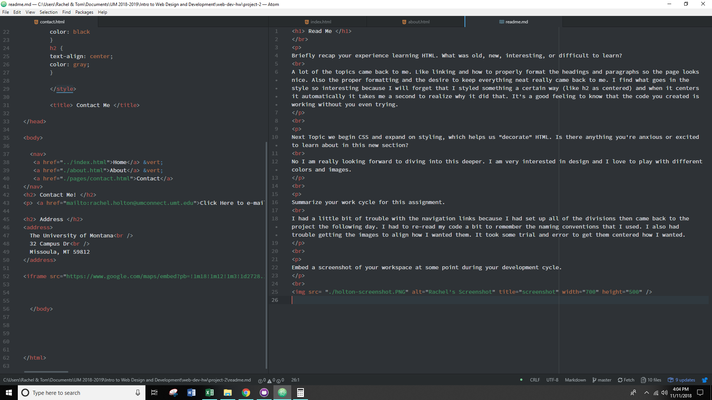

<h1> Read Me </h1>
 

Briefly recap your experience learning HTML. What was old, new, interesting, or difficult to learn?
 
A lot of the topics came back to me. Like linking and how to properly format the headings and paragraphs so the page looks nice. Also the proper formatting and the desire to keep everything neat really came back to me. I find what goes in the style so interesting because I will forget that I styled something a certain way (like h2 as centered) and when it centers it automatically it takes me a second to realize why it did that. It's a good feeling to know that the code you created is working without you even trying.

 

Next Topic we begin CSS and expand on styling, which helps us "decorate" HTML. Is there anything you're anxious or excited to learn about in this new section?
 
No I am really looking forward to diving into this deeper. I am very interested in design and I love to play with different colors and images.

 

Summarize your work cycle for this assignment.
 
I had a little bit of trouble with the navigation links because I had set up all of the divisions then came back to the project the following day. I had to re-read my code a bit to remember the naming conventions that I used. I also had trouble getting the images to align how I wanted them. It took some trial and error to get them centered how I wanted.

 

Embed a screenshot of your workspace at some point during your development cycle.

 

