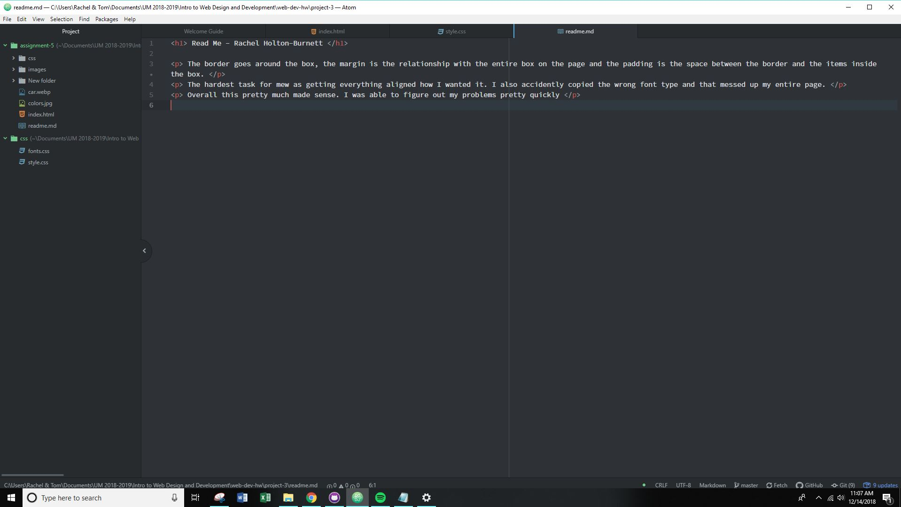

<h1> Read Me - Rachel Holton-Burnett </h1>

 The border goes around the box, the margin is the relationship with the entire box on the page and the padding is the space between the border and the items inside the box. 

 The hardest task for mew as getting everything aligned how I wanted it. I also accidently copied the wrong font type and that messed up my entire page. 

 Overall this pretty much made sense. I was able to figure out my problems pretty quickly 

    
